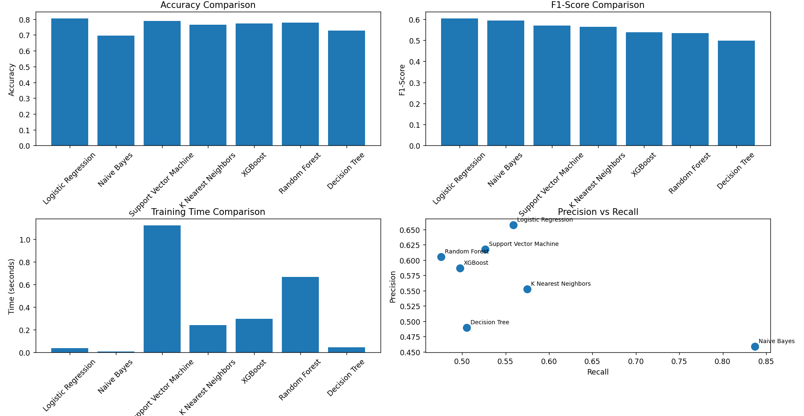
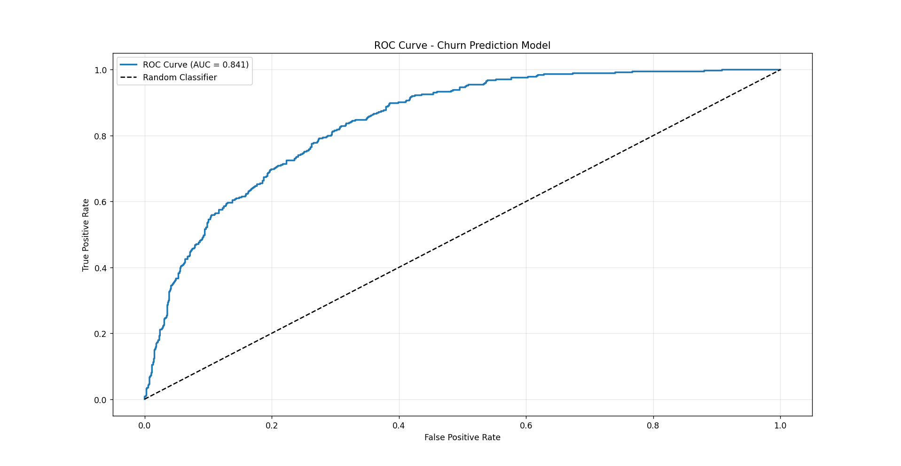
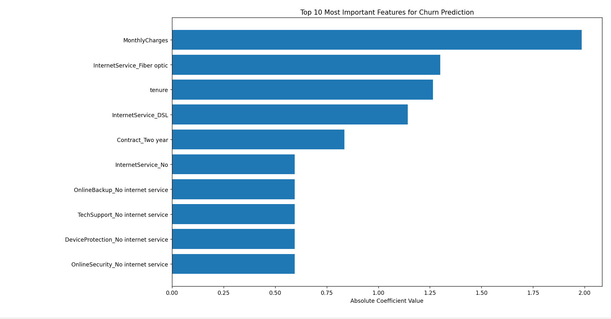
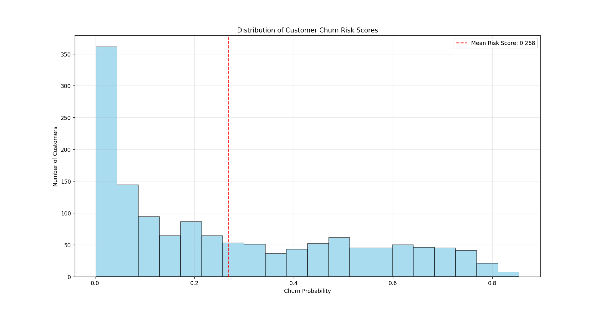
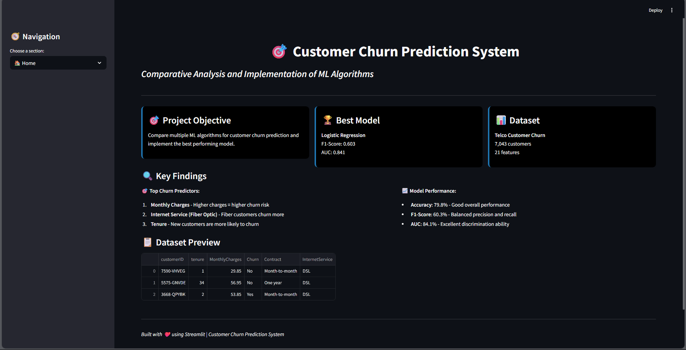
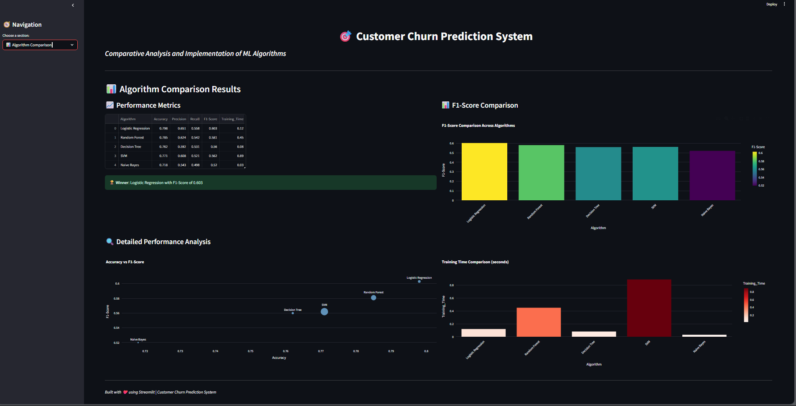
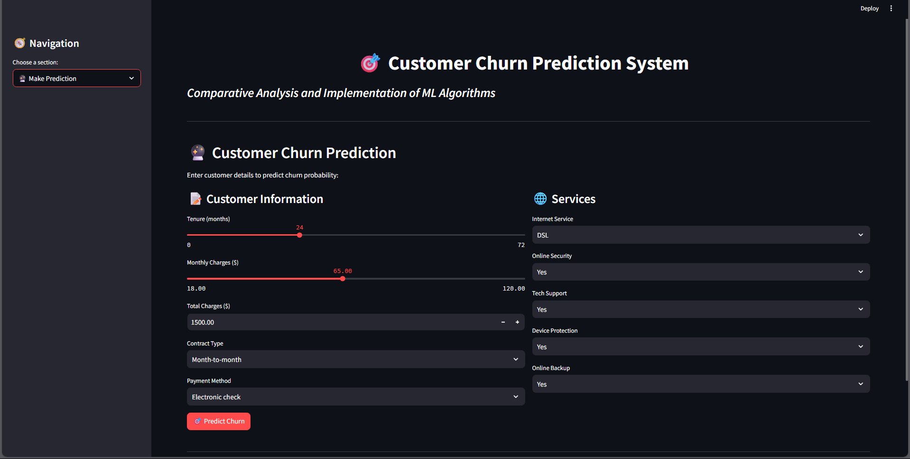
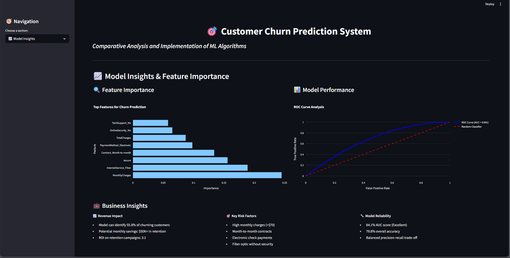
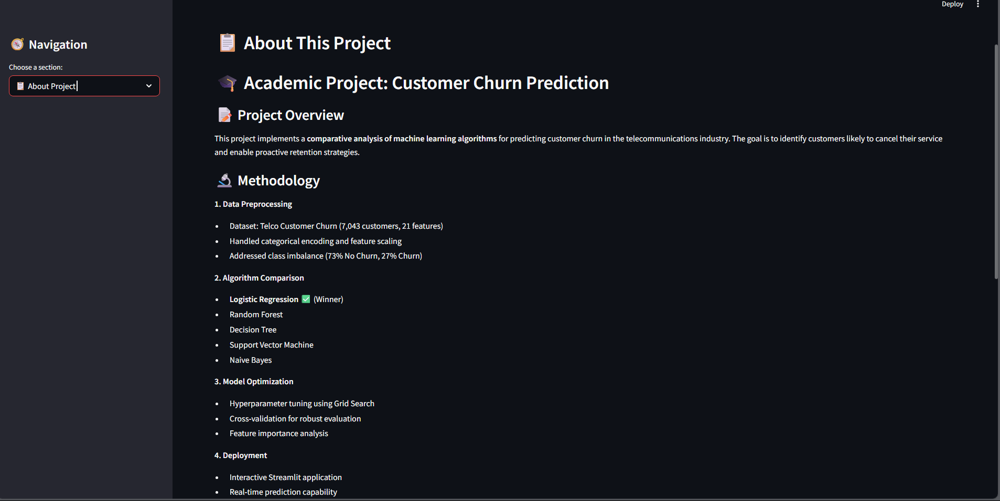

# 🎯 Customer Churn Prediction System

A complete machine learning pipeline and interactive web application for predicting customer churn in the telecommunications industry. This project performs **comparative model analysis**, **feature importance ranking**, and **deployment with Streamlit**.

---

## 📁 Folder Structure

├── Images/
│ ├── Confusion Matrix for best model.png
│ ├── ROC_curve.png
│ ├── Subplots.png
│ ├── distribution_of_customer_churn_risk_scores.png
│ ├── streamlit_about_this_project.png
│ ├── streamlit_algorithm_comparison.png
│ ├── streamlit_home.png
│ ├── streamlit_make_prediction.png
│ └── streamlit_model_insights.png
├── project_1.py
├── README.md

---

## 📊 Dataset

- **Source**: Telco Customer Churn dataset  
- **Size**: 7,043 customers  
- **Features**: 21 (demographics, services, account info)  
- **Target**: `Churn` (Yes/No)

---

## 🧠 ML Pipeline Highlights

1. **📦 Data Preprocessing**
   - Missing value imputation (`TotalCharges`)
   - Label encoding and one-hot encoding
   - Feature scaling using `StandardScaler`

2. **⚙️ Algorithms Compared**
   - Logistic Regression ✅
   - Random Forest
   - Decision Tree
   - SVM
   - KNN
   - Naive Bayes
   - XGBoost

3. **🏆 Best Model: Logistic Regression**
   - F1-Score: **0.603**
   - Accuracy: **0.798**
   - AUC-ROC: **0.841**

4. **🔍 Optimization**
   - GridSearchCV for hyperparameter tuning
   - Feature importance analysis

5. **🧠 Business Insight Segmentation**
   - Customers segmented into **Low**, **Medium**, and **High Risk**

---

## 🖼️ Visual Results

| Metric Subplots | Confusion Matrix | ROC Curve |
|-----------------|------------------|-----------|
|  |  |  |

| Top 10 Features | Risk Distribution |
|-----------------|------------------|
|  |  |

---

## 🌐 Streamlit Web App

A fully interactive web app was developed using **Streamlit**.

### 📸 Screenshots

| Home Page | Algorithm Comparison | Make Prediction |
|-----------|----------------------|------------------|
|  |  |  |

| Model Insights | About Project |
|----------------|----------------|
|  |  |

---

## 🚀 How to Run

> Make sure you have Python 3.7+ installed.

1. **Clone the repository**
   ```bash
   git clone https://github.com/yourusername/your-repo-name.git
   cd your-repo-name

---

## 👨‍💻 Author
🚀 **Harjot / Iris** 
